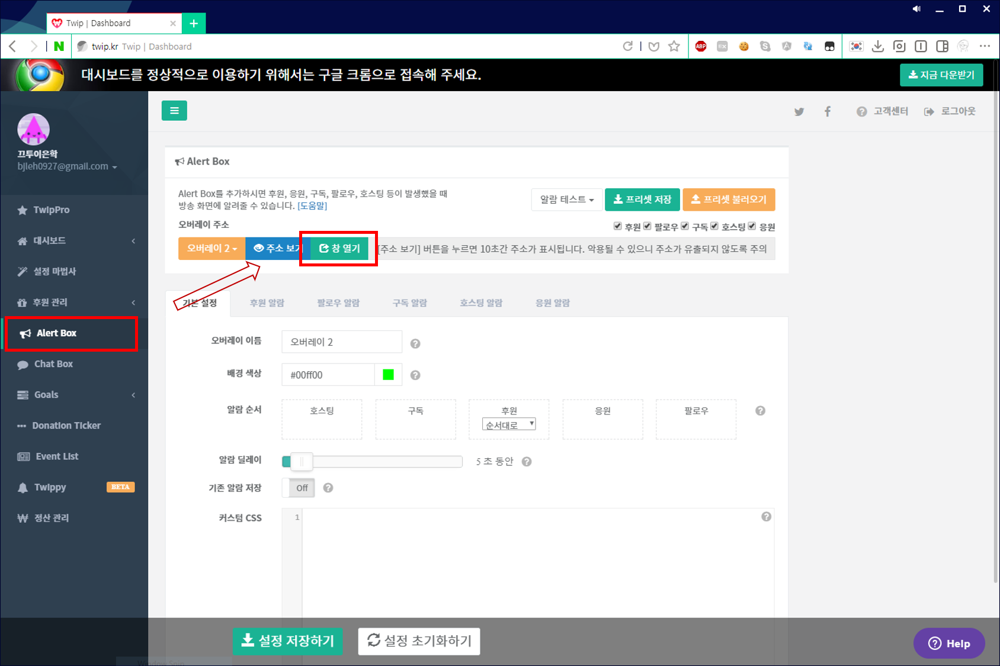
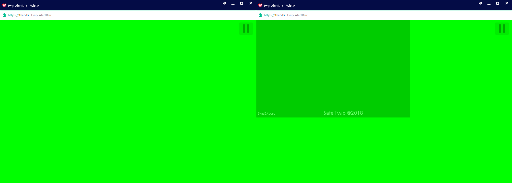

# 

Twip 을 통해 보여지는 영상도네이션을 미리 확인할 수 있습니다.

**! CAUTION !** 방송 소프트웨어가 아닌 브라우저에 설치하는 스크립트입니다. Xsplit/OBS를 통해 보시는게 아니라 웹브라우저를 하나 더 띄워서 보시는겁니다.

## Installation

- Chrome 혹은 Chromium 기반의 브라우저.
- Tampermonkey 확장프로그램
    - (https://chrome.google.com/webstore/detail/tampermonkey/dhdgffkkebhmkfjojejmpbldmpobfkfo)

### How to install

가장 먼저 브라우저를 설치합니다. 아래는 필자가 테스트해본 브라우저의 링크입니다.

- [Google Chrome](https://www.google.com/chrome/)
- [Naver Whale](http://whale.naver.com/)

브라우저를 통해 웹사이트에 접속했을 때 별도의 스크립트를 삽입하기 위해서는 `Tampermonkey`라는 확장프로그램이 필요합니다.

- [Tampermonkey](https://chrome.google.com/webstore/detail/tampermonkey/dhdgffkkebhmkfjojejmpbldmpobfkfo)

이제 스크립트를 설치할수 있습니다! 아래의 링크를 눌러서 `Install` 버튼을 눌러주세요.

[설치하기](https://raw.githubusercontent.com/R3turn-Dev/SafeTwip/master/safe_twip.user.js)

### How to use

이 스크립트는 Twip AlertBox 사이트에서 작동합니다. Twip Dashboard 에서 AlertBox 새 창을 열어주세요.

정상적으로 스크립트가 작동하면 오른쪽처럼 초록색 오버레이가 생깁니다.

아래의 버튼을 누르면 미리보기를 중단/재개할 수 있습니다. 영상을 일시정지하려면 위의 유투브 영상이 떴을 때 일시정지를 눌러주세요.

## Author

* **Lee Eunhak** (R3turn.Dev) - *Idea & Development* - [Github](https://github.com/return0927), [Facebook](https://fb.com/R3turn.01)
* **Heon** (from Charming_Jo Discord) - *Idea*

## License

이 스크립트는 GPL 3.0 라이센스를 따릅니다. - [LICENSE](LICENSE) 를 통해 자세한 내용을 알아보실 수 있습니다.
